# safesub

**Harm-reduction companion: what is active in your body right now.**
Hebrew-first (RTL) with English, local-only data, React Native (Expo).

safesub does not encourage use and is not a quitting tool. It shows, in real time, the
estimated rise / peak / decline of what you logged — population-average pharmacokinetics
from the literature — and flags dangerous overlaps between active substances
(dangerous / unsafe / caution). No doses, ever. Not medical advice. Everything stays on
the device.

> The full orientation for contributors and AI agents is in [`CLAUDE.md`](CLAUDE.md) (Hebrew).

## Screenshots (Android emulator, captured by the Maestro flows)

| | | | |
|---|---|---|---|
| 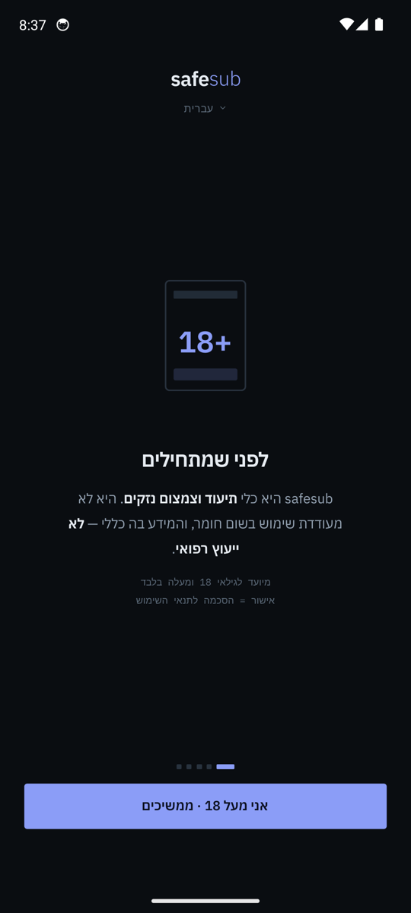 | 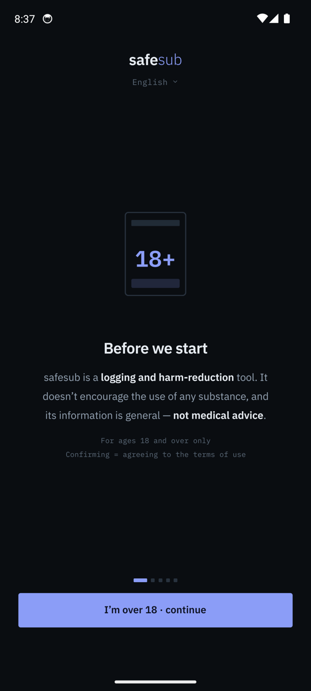 | 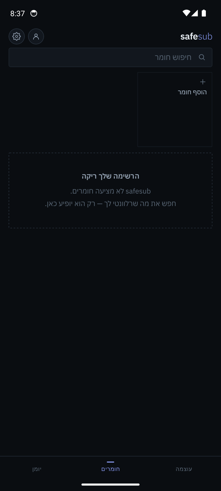 | 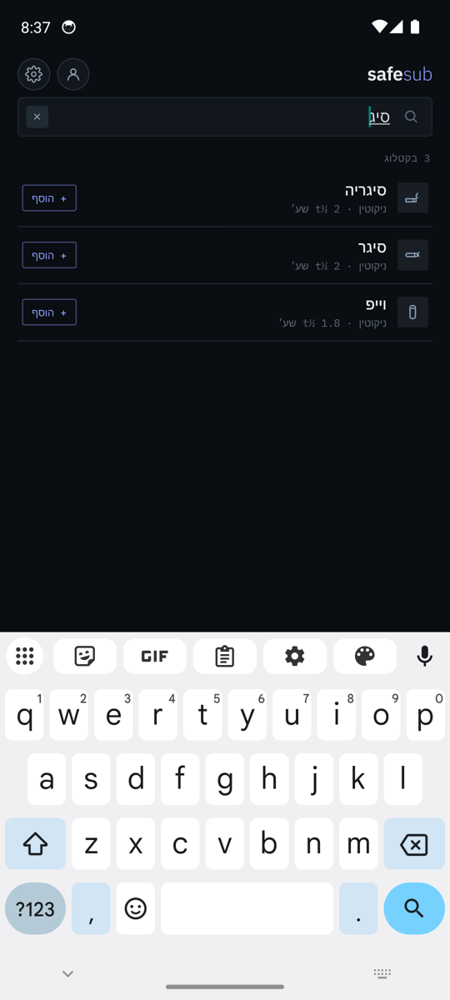 |
| 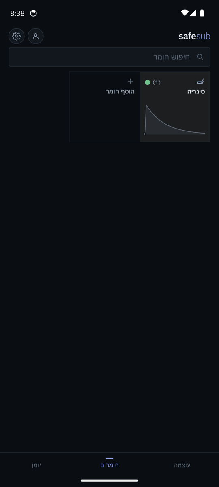 | 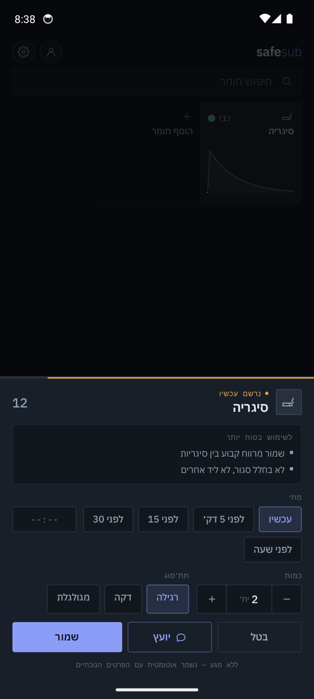 | 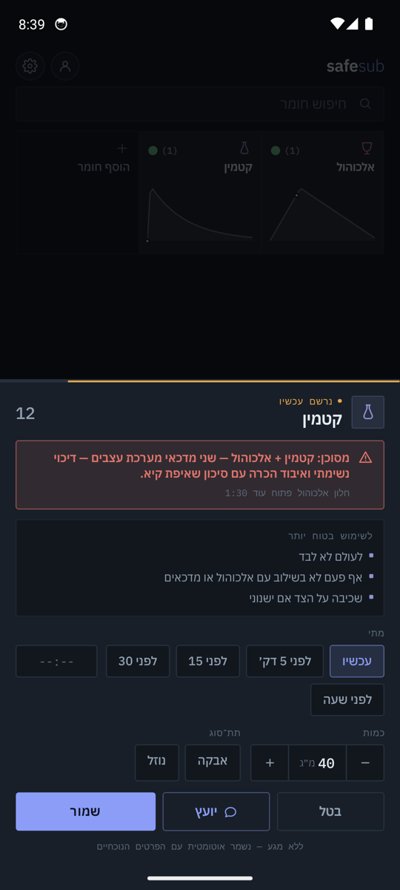 | 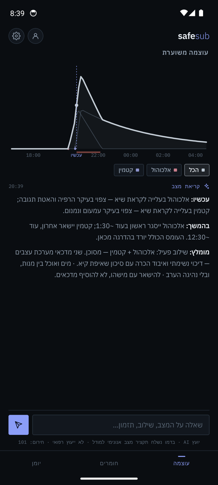 |
| 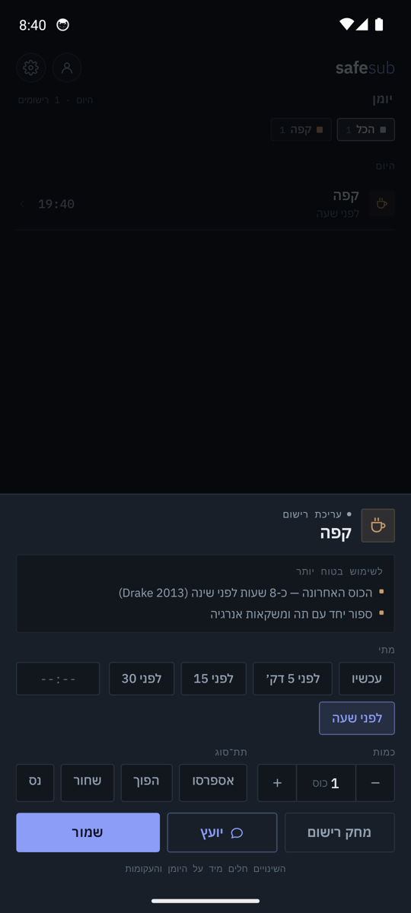 | 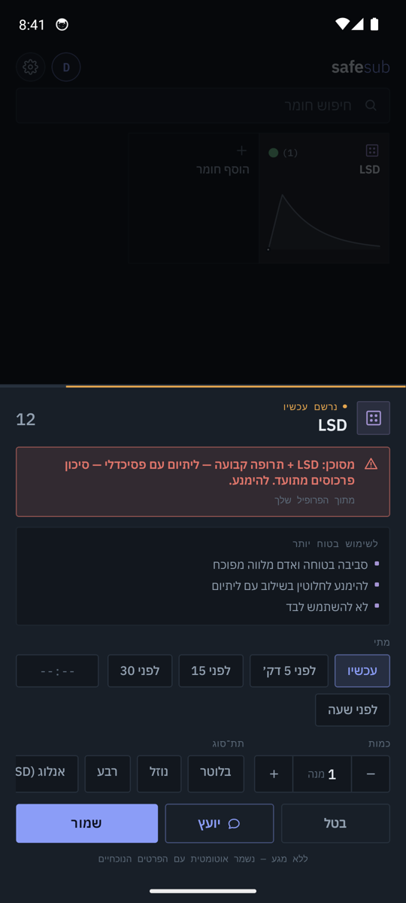 | 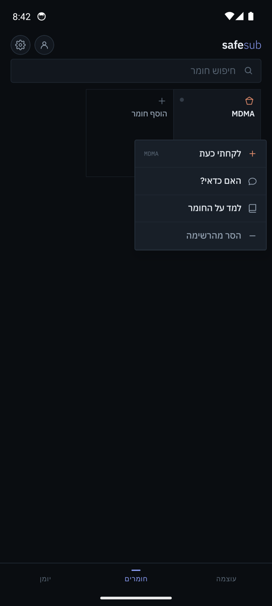 | 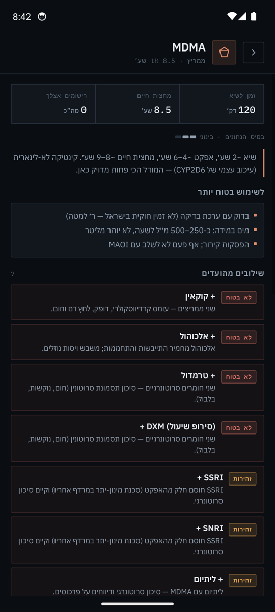 |
| 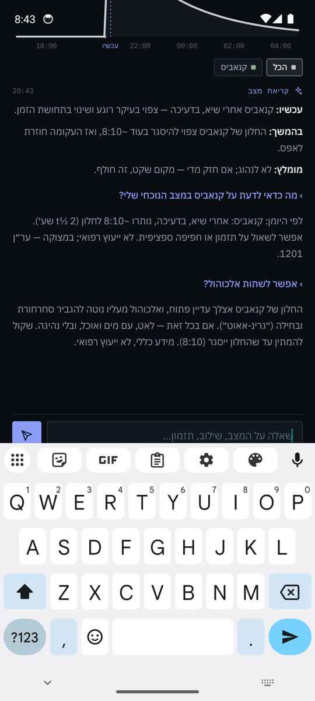 | 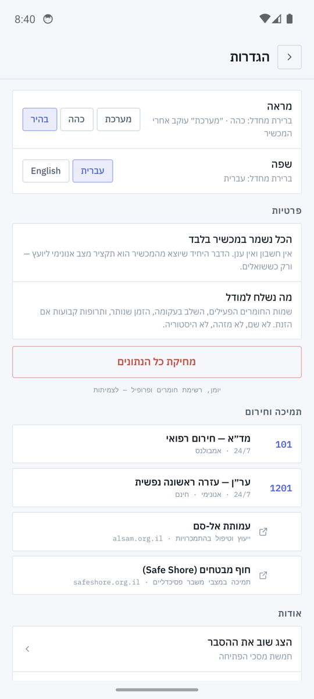 | 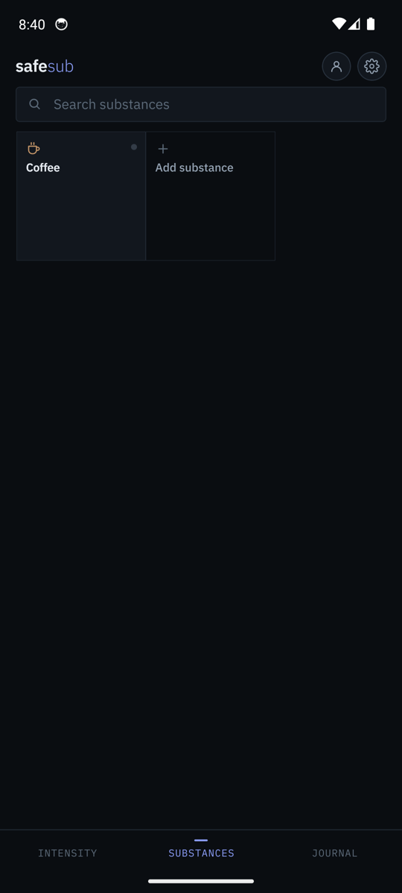 | 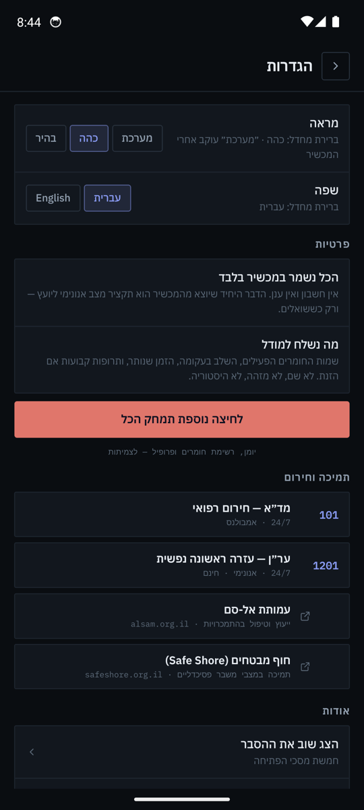 |

## Layout

| path | what |
|---|---|
| [`app/`](app/) | the React Native app (Expo SDK 57, TypeScript) |
| `app/src/engine` | PK engine, 68-entry substance catalogue, interaction rules |
| `app/src/i18n` | Hebrew / English dictionaries (Hebrew is the source of truth) |
| `app/__tests__` | Jest: golden PK test (2,316 samples, zero drift) + interaction/advisor tests |
| `app/e2e` | Maestro user-flow simulations for the Android emulator |
| [`demo-reference.html`](demo-reference.html) | the original single-file reference demo — design and logic source of truth |
| [`test/`](test/) | the demo's golden PK test |
| [`docs/`](docs/) | stack decision, App Store strategy, AI-advisor architecture, [testing](docs/testing.md), [methodology & sources](docs/methodology.md) |

## Run

```bash
cd app
npm install
npm test               # engine golden + interaction tests
npm run typecheck
npm run android:release   # builds a release APK and installs it on the running emulator
./e2e/run.sh           # Maestro flows against the emulator (screenshots in test-artifacts/)
```

Requirements: Node ≥ 20, JDK 17, Android SDK (API 34+), an AVD, Maestro.

## The four hard rules

1. **Never doses.** No amounts, no redosing schedules, no instructions. Timing, overlaps and general safety principles only.
2. **Not medical advice.** Emergency: MDA 101 · emotional first aid: ERAN 1201.
3. **Everything is an estimate.** Population averages; individual variation is shown, and so is how strong the data is (A/B/C per substance).
4. **Privacy above all.** No account, no cloud. The only thing that ever leaves the device is an anonymous state summary for the AI advisor — and only when you ask.
